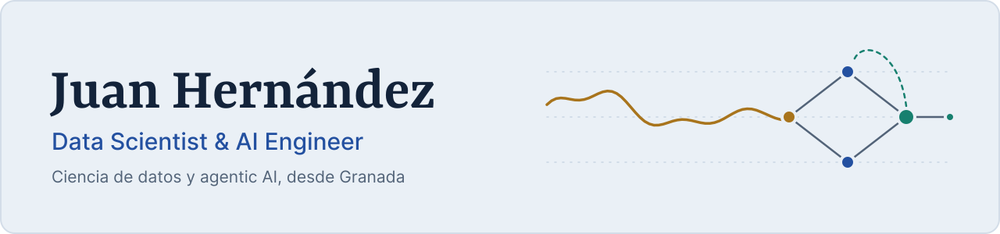

<a href="https://portfolio-web-juanhdezzs-projects.vercel.app">
  <picture>
    <source media="(prefers-color-scheme: dark)" srcset="assets/banner-dark.svg">
    <source media="(prefers-color-scheme: light)" srcset="assets/banner-light.svg">
    
  </picture>
</a>

  Hago de puente entre los equipos técnicos y el negocio: del dato en bruto al modelo, 
  y del modelo a una recomendación que se entiende y se puede decidir.

  <a href="https://portfolio-web-juanhdezzs-projects.vercel.app"><b>Portfolio</b></a>
  &nbsp;&nbsp;|&nbsp;&nbsp;
  <a href="https://www.linkedin.com/in/juan-hernandez-sag/"><b>LinkedIn</b></a>
  &nbsp;&nbsp;|&nbsp;&nbsp;
  <a href="mailto:jhernandezsanchezagesta@gmail.com"><b>Email</b></a>

## Sobre mí

Soy **Juan Hernández Sánchez-Agesta**, Data Scientist y AI Engineer en Granada. Me formé en Ingeniería Informática y en Administración y Dirección de Empresas, y después hice el Máster en Ciencia de Datos de la Universidad de Granada. Esa mezcla es la que uso cada día: entender el problema de negocio, resolverlo con datos y explicarlo a quien tiene que decidir.

- **Ahora:** Data Scientist en **WhiteBox**, dentro de un proyecto de consultoría para Renfe. Ciclo completo: preparación de datos, análisis exploratorio, modelado predictivo y entrega de insights a negocio.
- **Antes:** AI Engineer / Automation Engineer en **NTT Data** (automatización con APIs, workflows e IA generativa, LangChain/LangGraph) y Data Engineer Trainee en **NFQ** (Spark y ecosistema Hadoop).
- **Lo que más me interesa:** agentes de IA que se puedan evaluar y acotar con guardrails, preguntas en lenguaje natural sobre datos (NL→SQL), interfaces de voz y modelos de series temporales.

<b>In English</b>

 

Data Scientist and AI Engineer based in Granada, Spain, with a background in Computer Engineering, Business Administration and a Master's in Data Science (University of Granada). I currently work as a Data Scientist at WhiteBox, on a consulting project for Renfe. Before that I built GenAI automations at NTT Data and Spark pipelines at NFQ. I enjoy bridging technical teams and business stakeholders, and building agentic AI systems that can be measured.

## Proyectos destacados

### [emergencIAs](https://emergencias-platform.vercel.app)
Sala de mando de emergencias para España con agentes de IA. Reúne en una pantalla las alertas en tiempo real, una centralita 112 atendida por IA (transcripción, clasificación, prioridad y escalado a un operador humano), la gestión de cada situación con informes generados por IA y un mapa operativo por comunidades y provincias. La IA clasifica y propone; el operador decide.

<b>Stack:</b> TypeScript, Next.js 16, React 19, Hono, WebSockets, Zod, MapLibre, deck.gl, Claude (Anthropic API), Vitest, Playwright, Docker 
<a href="https://emergencias-platform.vercel.app">Abrir la demo</a> (repositorio privado)

### [Habla con tu dinero: asistente bancario por voz](https://unicaja-ai-assistant.vercel.app)
Consultar tus finanzas hablando: saldo, Bizum y preguntas libres sobre tus movimientos, con respuesta hablada y un gráfico generado al momento. Lo he construido en dos iteraciones:
- **v1:** agente LangGraph con herramientas bancarias, guardrails de dominio, control de alucinaciones con LLM-as-judge y confirmación explícita antes de cualquier operación. LLM intercambiable (Gemini, Cerebras, NVIDIA u Ollama).
- **v2 (en desarrollo):** agent loop propio sobre WebSocket, NL→SQL protegido con `sqlglot` (solo `SELECT`, tablas en lista blanca, `LIMIT` y timeout) y medido con un set de 50 preguntas en español, y voz en streaming con detección de actividad, STT, TTS e interrupción del usuario.

<b>Stack:</b> Python, FastAPI, LangGraph, LangChain, LangSmith, DuckDB, sqlglot, PostgreSQL, Whisper, Piper, Next.js, ECharts, pytest 
<a href="https://unicaja-ai-assistant.vercel.app">Abrir la demo (v1)</a> (repositorios privados)

### [StemAgent](https://github.com/juanhdezz/stem-agent)
Un agente base que se especializa solo, inspirado en las células madre (reto planteado por JetBrains). Dada una clase de problemas, busca en la web cómo los abordan los expertos, diseña su propia configuración (prompt, herramientas y flujo), se valida contra un benchmark etiquetado y repite hasta superar un umbral. Aplicado a code review en Python, pasa de un F1 de 0,180 con un agente genérico a 0,743 tras especializarse, en un benchmark propio de 37 fragmentos.

<b>Stack:</b> Python, LangGraph, LangChain, OpenAI API, Tavily, pytest 
<a href="https://github.com/juanhdezz/stem-agent">Ver el repositorio</a>

### [TFM: sesgo por heterogeneidad de pacientes en predicción de glucosa](https://github.com/juanhdezz/TFM-Glucose-Prediction)
¿Mejora un modelo LSTM de predicción de glucosa (diabetes tipo 1) si se balancean los datos de entrenamiento por edad y sexo? Comparo 21 condiciones (sobremuestreo, SMOTER, jittering, submuestreo e híbridos) en tres datasets de monitorización continua, con validación por grupos de pacientes y tests de Friedman y Nemenyi. Conclusión: el balanceo demográfico no mejora el rendimiento global de forma generalizable, y donde sí tiene efecto aparece un trade-off entre el error global y la hipoglucemia severa.

<b>Stack:</b> Python, TensorFlow/Keras, pandas, NumPy, imbalanced-learn, scikit-learn, SLURM, LaTeX 
<a href="https://github.com/juanhdezz/TFM-Glucose-Prediction">Ver el repositorio</a> | <a href="https://juanhdezz.github.io/TFM-Glucose-Prediction/">Leer la memoria (PDF)</a>

## Mapa de mis repositorios

| Si buscas... | Mira aquí |
|---|---|
| Agentes y LLMs | [stem-agent](https://github.com/juanhdezz/stem-agent), [playbook-ai](https://github.com/juanhdezz/playbook-ai) (prototipo temprano de agente personal) |
| Investigación en ML | [TFM-Glucose-Prediction](https://github.com/juanhdezz/TFM-Glucose-Prediction) |
| Máster en Ciencia de Datos (UGR) | [Repos `*-DATCOM-UGR`](https://github.com/juanhdezz?tab=repositories&q=DATCOM): prácticas de series temporales, big data, minería de medios sociales, detección de anomalías, soft computing y más |
| Desarrollo de software | [TFG](https://github.com/juanhdezz/tfg_gestion_ccia) (aplicación Laravel para el departamento CCIA de la UGR), [portfolio-web](https://github.com/juanhdezz/portfolio-web) |
| Primeros proyectos | [BI con Civica](https://github.com/juanhdezz/BI_Civica_DataAnalyticsProject), [detección de fraude](https://github.com/juanhdezz/Fraud_detection_analytics_project), [RoomRadar](https://github.com/juanhdezz/RoomRadar-Scrapper) (scraping) |

## Stack

| Área | Herramientas |
|---|---|
| Lenguajes | Python, SQL, R, TypeScript, Java, C++ |
| ML y deep learning | scikit-learn, PyTorch, TensorFlow/Keras (LSTM), pandas, NumPy, imbalanced-learn |
| Agentes y LLMs | LangGraph, LangChain, LangSmith, OpenAI API, Claude (Anthropic API), Gemini, Tavily |
| Datos y big data | Spark (PySpark y Scala), Hadoop, HDFS, Pig, Databricks, DuckDB, PostgreSQL, MySQL, MongoDB |
| Producto | FastAPI, Next.js, React, WebSockets, ECharts |
| Herramientas | Docker, GitHub Actions, pytest, Playwright, SLURM, Google Cloud |

## Trayectoria

**Experiencia**
- Data Scientist, WhiteBox jul 2026 – actualidad
- AI Engineer / Automation Engineer, NTT Data Europe & LATAM ene 2026 – jul 2026
- Data Engineer Trainee, NFQ sep 2025 – ene 2026

**Formación**
- Máster en Ciencia de Datos, Universidad de Granada 2025 – 2026
- Grado en Ingeniería Informática, Universidad de Granada 2020 – 2025
- Grado en Administración y Dirección de Empresas, Universidad de Granada 2020 – 2025

**Logros**
- **HackSpain 2026:** uno de los 250 builders técnicos menores de 30 años seleccionados en España para un hackathon presencial de 36 horas en la UPM.
- **Ideas Factory UGR (UGRemprendedora):** 1.er puesto, y después 3.er puesto en la final del Concurso Provincial de Ideas de Negocio, con un premio de 1.400 €.

**Certificaciones**
- Google Cloud Certified Generative AI Leader, Google Cloud Digital Leader
- Cambridge B2 First (FCE)
- Project Management (Coursera), Business Intelligence, Data Discovery and SQL (Civica), Data-Driven Analytics (Platzi)

## Actividad reciente

Últimos repositorios públicos con cambios. Se actualiza cada semana con una [GitHub Action](https://github.com/juanhdezz/juanhdezz/blob/main/.github/workflows/activity.yml).

<!-- activity:start -->
- [TFM-Glucose-Prediction](https://github.com/juanhdezz/TFM-Glucose-Prediction) Jupyter Notebook, último push 2026-10-03
- [stem-agent](https://github.com/juanhdezz/stem-agent) Python, último push 2026-10-03
- [portfolio-web](https://github.com/juanhdezz/portfolio-web) TypeScript, último push 2026-10-03
- [Aplicaciones-Ciencia-Datos-DATCOM-UGR](https://github.com/juanhdezz/Aplicaciones-Ciencia-Datos-DATCOM-UGR) Jupyter Notebook, último push 2026-06-16
- [Emprendimiento-Transferencia-Conocimiento-DATCOM-UGR](https://github.com/juanhdezz/Emprendimiento-Transferencia-Conocimiento-DATCOM-UGR) Sin lenguaje, último push 2026-06-16
<!-- activity:end -->

## Contacto

Si quieres hablar de datos, agentes de IA o de un proyecto, escríbeme a **[jhernandezsanchezagesta@gmail.com](mailto:jhernandezsanchezagesta@gmail.com)** o búscame en **[LinkedIn](https://www.linkedin.com/in/juan-hernandez-sag/)**. Tienes más detalle de cada proyecto en mi **[portfolio](https://portfolio-web-juanhdezzs-projects.vercel.app)**.
